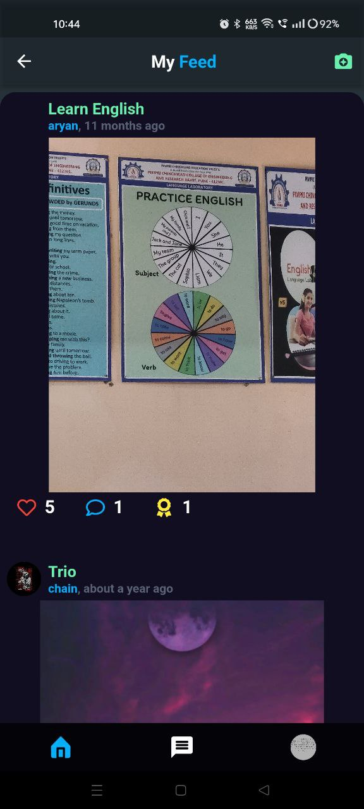
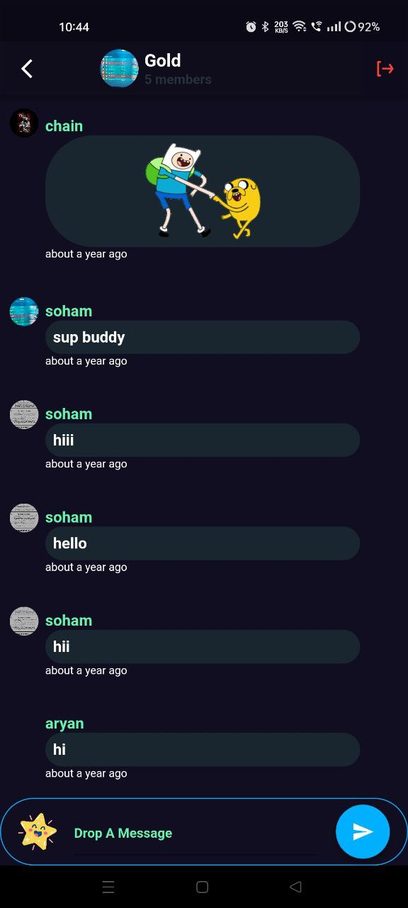
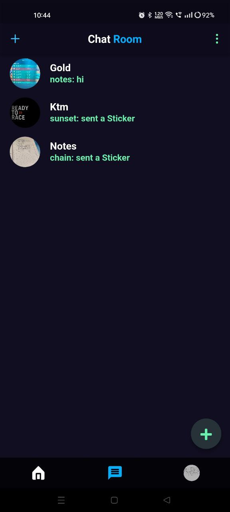
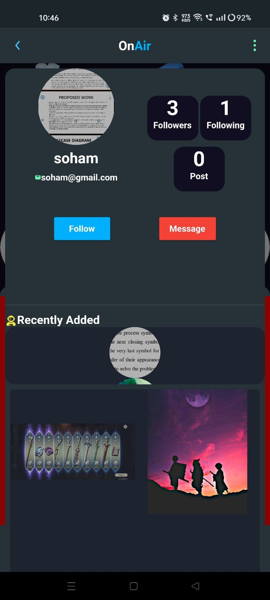

# OnAir

OnAir is a social media app built with Flutter that leverages Firestore for its backend. The app includes a variety of features such as a social feed, group chat with stickers, and profile pages with followers and followings.

## Features

- **Social Feed**: Share posts with your followers and see updates from people you follow.
- **Group Chat**: Engage in group conversations with the ability to send stickers.
- **Profile Pages**: Manage your profile, follow and unfollow other users, and see who follows you.

## Screenshots

<!-- Include some screenshots of your app -->







## Installation

1. **Clone the repository:**
    ```sh
    git clone https://github.com/tanaynaphade/OnAir.git
    cd OnAir
    ```

2. **Install dependencies:**
    ```sh
    flutter pub get
    ```

3. **Configure Firestore:**
    - Set up a Firebase project in the [Firebase Console](https://console.firebase.google.com/).
    - Add an Android and iOS app to your Firebase project.
    - Download the `google-services.json` file for Android and place it in the `android/app` directory.
    - Download the `GoogleService-Info.plist` file for iOS and place it in the `ios/Runner` directory.
    - Enable Firestore in your Firebase project.

4. **Run the app:**
    ```sh
    flutter run
    ```

## Usage

Once the app is up and running, you can:

- **Create an Account**: Sign up using your email address.
- **Create Posts**: Share your thoughts or media on your feed.
- **Join Group Chats**: Start or join group conversations and express yourself with stickers.
- **Follow Users**: Follow other users to see their posts and get followed back.

## Contributing

We welcome contributions! Here’s how you can help:

1. Fork the repository.
2. Create a new branch (`git checkout -b feature-branch`).
3. Make your changes and commit them (`git commit -m 'Add some feature'`).
4. Push to the branch (`git push origin feature-branch`).
5. Open a pull request.


## Contact
tanaynaphade35@gmail.com

